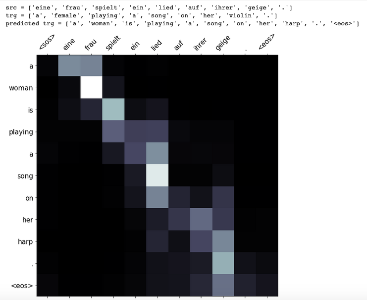

# NTM_EN_DE_ATTENTION
This repo is about the NTM from German to English.  
<em><b>Dataset</b></em>: English and German dataset downloaded from Spacy, which is tokenized and transferred to lower cases. Then they are splited into train, validation and test dataset.  
<em><b>Encoder</b> </em>and <em><b>Decoder</b></em>: GRU, attention and masking are applied 
<em><b>BLEU score</b></em>: around 29 
<em><b>Visualization</b> </em>of the result: 
src is the input of German sentences and trg is the groud truth, and prd is the prediction.  
</img>
